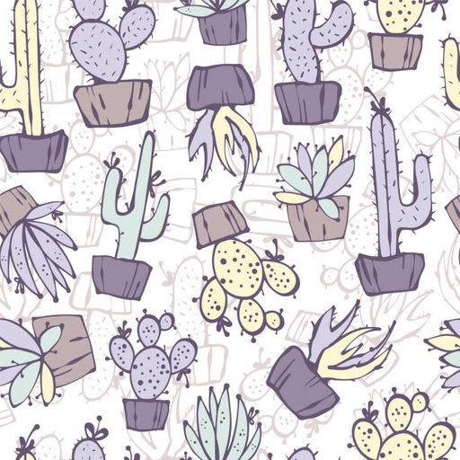
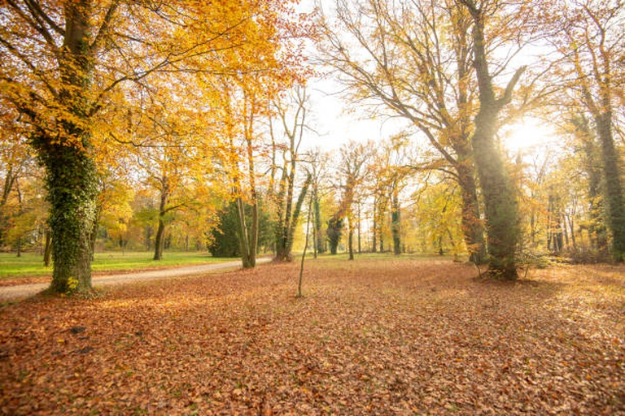
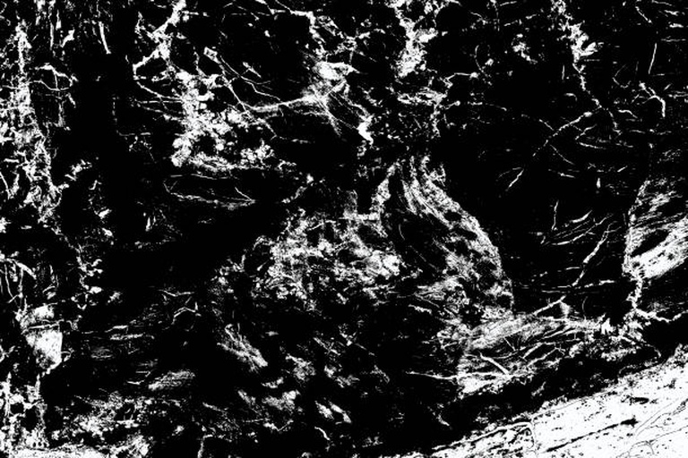
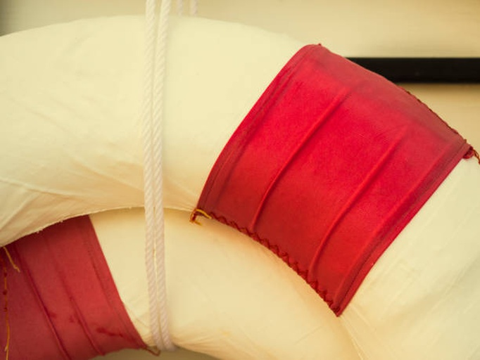

# Image Keywording by CLIP

Code for finding the most suitable keywords for images from the pre-defined vocabulary using a [OpenAi-CLIP](https://github.com/openai/CLIP).
UPD. Added a method to find images by target queries.

## Image Keywording usage
Set the variables in `settings.py` (load your images and vocabulary), then run
```bash
$ python process.py
```
as a result, you will get a dataframe, where each image corresponds to a list of keywords from the vocabulary.


## Image Search usage
Set the variables in `settings.py` (load your images and vocabulary, add targets query and synonyms for them), then run
```bash
$ python process.py --mode image_search
```
as a result, you will get folders with the most appropriate images for each query in the list of queries.


## Good keywording examples (with stock keywords vocabulary)
<br/>

<p style="text-align: left;">
    <strong>Keywords:</strong> <em>"cushion cactus", "lavender - plant", "peyote cactus", "cholla cactus", "saguaro cactus", "foliate pattern", "claret cup cactus", "floral pattern", "night-blooming cactus", "textile patch"</em>
</p>
<br/>

<p style="text-align: left;">
    <strong>Keywords:</strong> <em>"oak woodland", "autumn equinox", "autumn", "autumn collection", "bavarian forest", "national memorial arboretum", "tree area", "woodland trail", "autumn winter collection", "arboretum"</em>
</p>

## Bad keywording examples (with stock keywords vocabulary)
<br/>

<p style="text-align: left;">
    <strong>Keywords:</strong> <em>"lagoon nebula", "black and white instant print", "radiogram - photographic image", "navajo sandstone formations", "pyroclastic flow", "labyrinthine brain coral", "seismograph", "neptune - planet", "stream - body of water", "electron micrograph"</em>
</p>
<br/>

<p style="text-align: left;">
    <strong>Keywords:</strong> <em>"ribbon - sewing item", "surgical glove", "red-breasted merganser", "elastic bandage", "red-necked grebe", "adhesive bandage", "leg of mutton sleeve", "breast cancer awareness ribbon", "formal glove", "garter belt"</em>
</p>

\* Note, if the results are bad, check that required keywords are in the dictionary, and that you are using the appropriate prompt template for your keywords/images.