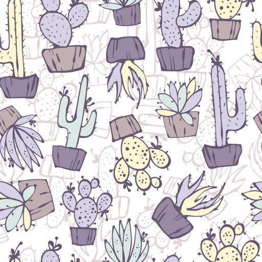
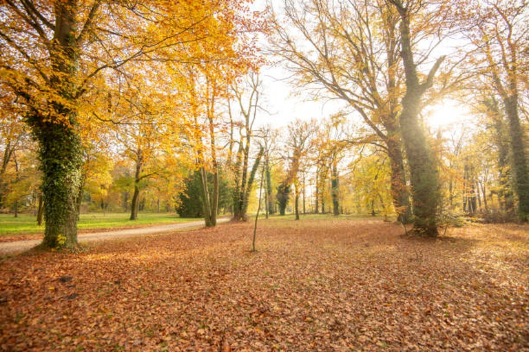
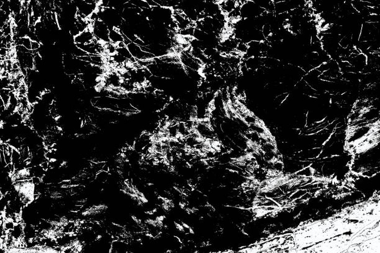
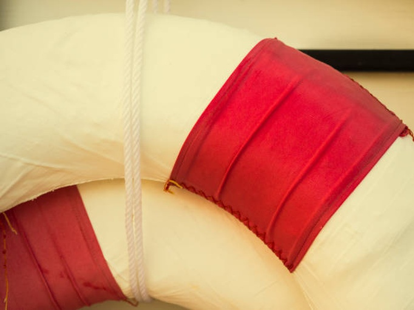

# Image Keywording by CLIP

Code for finding the most suitable keywords for images from the given vocabulary using a [OpenAi-CLIP](https://github.com/openai/CLIP).

## Usage

```bash
$ python process.py --batch_size 128 --template 'photo for an article on the topic of <keyword>.' --top_k 10
```
Note, default template showed the best keyword results for stock photos.

## Examples
Hover over the image to see the keywords.

<p align="left">
    
    
    
    
</p>
